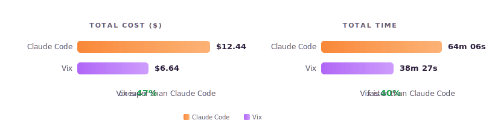

<div align="center">


Sleek, Fast and Token Efficient AI Coding Agent

[](https://github.com/kirby88/vix-releases/releases)
[vix website][https://getvix.dev]
</div>

<div align="center">

## Demo

</div>

<div align="center">


</div>

<div align="center">

## Benchmark

</div>

**Preamble**: this is by no means a scientific approach. This is merely an observation, that we've been able to observe over and over again.

Vix plan mode was evaluated across 7 real coding scenarios **using the exact same prompt as claude code** (cf. this [repo](https://github.com/Piebald-AI/claude-code-system-prompts/tree/main)). The goal was to measure time and cost in different real-life situations like starting a project from scratch, fixing a bug in an open source library (serde-rs), adding a feature to a massive codebase, refactor file based on tests, ask for test coverage above 80% etc.

Here are the results:



| Task | cc cost | vix cost | cc time | vix time |
|------|--------:|---------:|--------:|---------:|
| 1. [swift] Write a full LRU file cache spec from scratch with no existing code<br>[task](https://github.com/kirby88/vix-eval/blob/main/tasks/task1_LRUFileCacheSPec/prompt.md) · [→ cc plan](https://github.com/kirby88/vix-eval/blob/main/tasks/task1_LRUFileCacheSPec/results/claude-code/20260406-095102/plan.md) · [→ vix plan](https://github.com/kirby88/vix-eval/blob/main/tasks/task1_LRUFileCacheSPec/results/vix/20260406-103351/plan.md) | $1.82 | $0.30 | 11m30s | 2m43s |
| 2. [swift] Add distributed tracing with context propagation across a caching library<br>[task](https://github.com/kirby88/vix-eval/blob/main/tasks/task2_AddLoggingToCache/prompt_hard.md) · [→ cc plan](https://github.com/kirby88/vix-eval/blob/main/tasks/task2_AddLoggingToCache/results/claude-code/20260406-103902/plan.md) · [→ vix plan](https://github.com/kirby88/vix-eval/blob/main/tasks/task2_AddLoggingToCache/results/vix/20260406-105944/plan.md) | $2.18 | $0.84 | 14m34s | 5m7s |
| 3. [rust] Fix non-string enum key parsing bug in serde_json<br>[task](https://github.com/kirby88/vix-eval/blob/main/tasks/task3_FixJsonParsingBug/prompt.md) · [→ cc plan](https://github.com/kirby88/vix-eval/blob/main/tasks/task3_FixJsonParsingBug/results/claude-code/20260406-111042/plan.md) · [→ vix plan](https://github.com/kirby88/vix-eval/blob/main/tasks/task3_FixJsonParsingBug/results/vix/20260406-111950/plan.md) | $0.84 | $0.87 | 5m9s | 5m36s |
| 4. [python] Write pytest suite to 80%+ coverage for a large export module<br>[task](https://github.com/kirby88/vix-eval/blob/main/tasks/task4_WriteTestsForExportFlows/prompt.md) · [→ cc plan](https://github.com/kirby88/vix-eval/blob/main/tasks/task4_WriteTestsForExportFlows/results/claude-code/20260406-122537/plan.md) · [→ vix plan](https://github.com/kirby88/vix-eval/blob/main/tasks/task4_WriteTestsForExportFlows/results/vix/20260406-125302/plan.md) | $2.03 | $1.45 | 11m55s | 8m50s |
| 5. [python] Refactor module guided by existing tests without breaking behavior<br>[task](https://github.com/kirby88/vix-eval/blob/main/tasks/task5_RefactorBasedOnTests/prompt.md) · [→ cc plan](https://github.com/kirby88/vix-eval/blob/main/tasks/task5_RefactorBasedOnTests/results/claude-code/20260406-132329/plan.md) · [→ vix plan](https://github.com/kirby88/vix-eval/blob/main/tasks/task5_RefactorBasedOnTests/results/vix/20260406-135507/plan.md) | $3.65 | $1.86 | 12m37s | 9m13s |
| 6. [ts] Add French localization to OpenClaw following existing i18n patterns<br>[task](https://github.com/kirby88/vix-eval/blob/main/tasks/task6_AddFrenchSupportToOpenClaw/prompt.md) · [→ cc plan](https://github.com/kirby88/vix-eval/blob/main/tasks/task6_AddFrenchSupportToOpenClaw/results/claude-code/20260406-144348/plan.md) · [→ vix plan](https://github.com/kirby88/vix-eval/blob/main/tasks/task6_AddFrenchSupportToOpenClaw/results/vix/20260406-145913/plan.md) | $1.38 | $0.97 | 5m32s | 4m53s |
| 7. [rust] Fix a Rust compilation error from CI logs (no git history allowed)<br>[task](https://github.com/kirby88/vix-eval/blob/main/tasks/task7_FixCompileBugCodex/prompt.md) · [→ cc plan](https://github.com/kirby88/vix-eval/blob/main/tasks/task7_FixCompileBugCodex/results/claude-code/20260406-153600/plan.md) · [→ vix plan](https://github.com/kirby88/vix-eval/blob/main/tasks/task7_FixCompileBugCodex/results/vix/20260406-160454/plan.md) | $0.53 | $0.36 | 2m45s | 2m5s |
| **Total** | **$12.44** | **$6.64** | **64m6s** | **38m30s** |

### Summary

Vix is faster and cheaper on almost all tasks except on the 3rd one. Going deeper, the issue is that this specific task is about reading and editing a very long file (more than 3,000 loc). In that case the minified version wasn't helping much as it was happening only during the exploration part once, the execution part falling back to the regular read/edit tools. We already have a plan to address that and we plan to release very soon an update that will hopefully help with this specific kind of task.

Regarding the quality of the plans produced, it's always hard to have a qualitative assessment of LLMs' output. We tried LLM-as-a-judge, difference-by-k-votes etc. which gave similar results for both claude code and vix, but ultimately we think this is one of those things where putting a number on it just doesn't make sense, and as a developer you just need to read these plans and make an opinion by yourself. On a personal level, we didn't see any changes with claude code, we believe that as long as the model (Claude Opus 4.6 in this case) is the same and you provide it with the same set of tools, results should be somewhat similar.

All benchmarks are fully reproducible and include the full LLM transcripts and plans. [https://github.com/kirby88/vix-eval](https://github.com/kirby88/vix-eval)

<div align="center">

## Install

</div>

> [!WARNING]
> Works only for macOS and Linus for now.

```bash
curl -fsSL https://getvix.dev/install | sh
```

You will need to define `ANTHROPIC_API_KEY` in your environment variables.

```bash
brew tap kirby88/vix-releases
brew install vix
```

Start the daemon:

```
vixd
```

and then you can start as many instances you want, each of them are isolated:

```bash
vix
```

<div align="center">

## Why is vix faster and cheaper in plan mode?

</div>

The following features allow vix to use fewer tokens without any apparent change in quality:

### Stem Agents

Vix tries to leverage cache as much as possible. The problem with the Explore/Plan/Execute approach is that each agent is specialized in a specific task (i.e. their system prompts are different), which makes it impossible to share cache between phases.

Vix introduces the concept of **`stem agent`** that creates a generic agent (i.e. its system prompt is not specific to a step). It lets the LLM know that multiple phases will take place in the conversation and that for each of these phases a user message will explain exactly what will be expected from the LLM.

Defining expected behavior in a user message vs. in a system prompt may in theory have some impact on the quality of the answers, but the impact should be minimal (they are both user instructions that the LLM is trained to satisfy). In practice we didn't notice any difference in quality.

But that shift changes everything in terms of cost because now the same cache can be used between different steps. So when vix agent is done with the explore phase, it just tells the LLM to now act as a planner (**`agent specialization`**).

> **The major difference with claude code is that all the planning phase can now be done with the history of the explore phase cached.**

There is also the fact that Claude Code's main agent system prompt allows to [spawn 3 Explore agents if needed](https://github.com/Piebald-AI/claude-code-system-prompts/blob/0cb6a727292e02128b9ab8ec1bab7ca2eb1de8e2/system-prompts/system-reminder-plan-mode-is-active-5-phase.md?plain=1#L30). There is no need to spawn 3 agents to explore, as the LLM will do the exploration by itself and continue exploring and reading code until it has enough context. Worse than that, we noticed multiple times that claude code was still using 3 agents to explore the code base just because it was able to, then these agents were reading the same set of files and there was literally no point in doing that.

### Virtual File System

Reading files is one of the biggest costs, especially during the explore phase where the LLM needs to create a "mental model" of the code base based on the user's demand.

We don't want to reduce or bridle the LLM in its capability of exploring the code base as it directly relates to the quality of its answer. Instead, we looked into what we sent to the LLM and we realized that we were sending a lot of characters that are not useful to understand the code (line returns, consecutive spaces, tabs... basically `\s+`).

After iterating with a couple of approaches, we realized that we could remove these white space altogether, so we implemented a virtual filesystem that let the LLM work in the minified world. The result is a reduction of anywhere between 20% and 50% of the number of tokens needed.

<div align="center">

## Philosophy

</div>

The project originated from listening to these 2 people:
* [Boris Cherny](https://x.com/bcherny) the creator of Claude Code, saying that [he didn't write a single line of code since November](https://stationf.co/news/boris-cherny).
* [Peter Steinberger](https://x.com/steipete) the creator of OpenClaw, saying that [he ships code he doesn't read](https://newsletter.pragmaticengineer.com/p/the-creator-of-clawd-i-ship-code).

While these claims are very personal and may not apply to everyone, we think they depict the world we are heading to where **we neither read nor write code anymore**. If that's the case, that fundamentally changes a lot of assumptions we have. And what that means specifically for AI coding agents is that they should optimize code not for reading and writing anymore, but focus more on AI agent efficiency instead.

Vix is also heavily influenced by the [MAKER](https://arxiv.org/abs/2511.09030) approach that we initially wanted to experiment with. Having a way to control what context you share within each step of your workflows, asking them to produce json, voting for the critical steps etc. All of these can be defined in a custom workflow in vix's `settings.json` file (more on that in the coming documentation).

That's how we came up with the idea of workflows, where instead of asking the LLM to spawn sub agents to explore, then another one to plan, and then to do the execution, we ask only one thing from them. It also allows for more flexible approaches, and more "mental space" for the LLM.

<div align="center">

## Roadmap

</div>

* Evaluate on Terminal-bench 2.0
* Implement cron tasks
* Implement full "project brain" to reduce Exploration cost and time